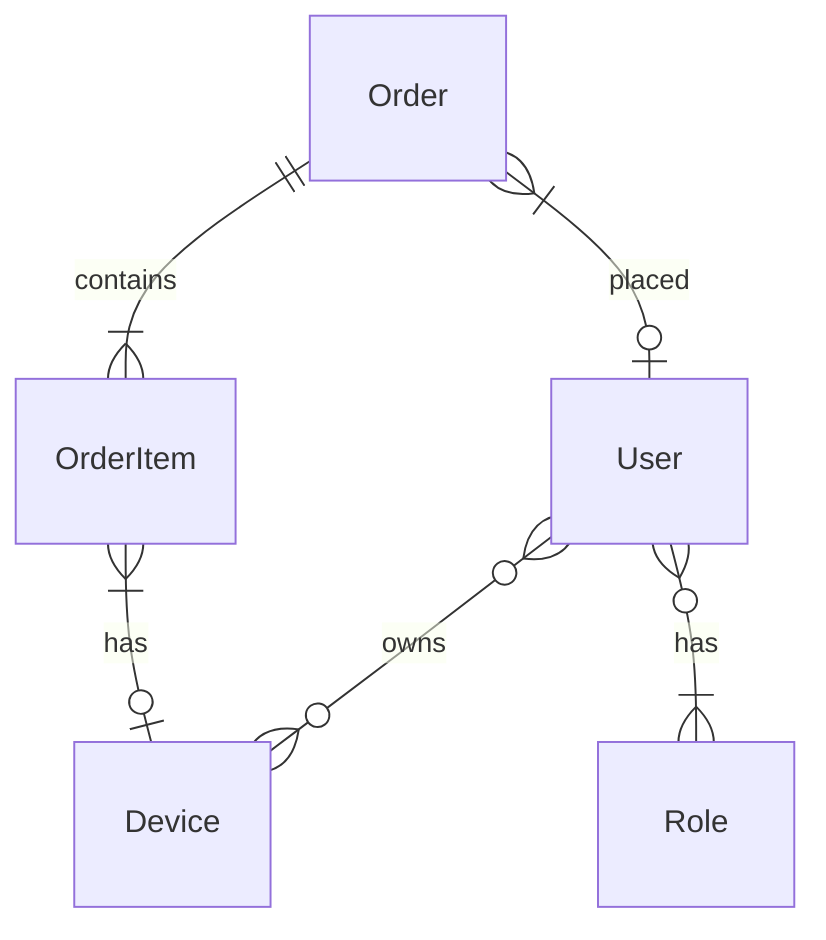
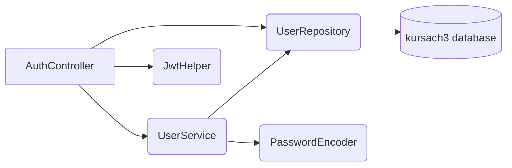
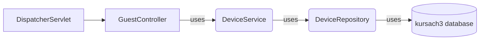
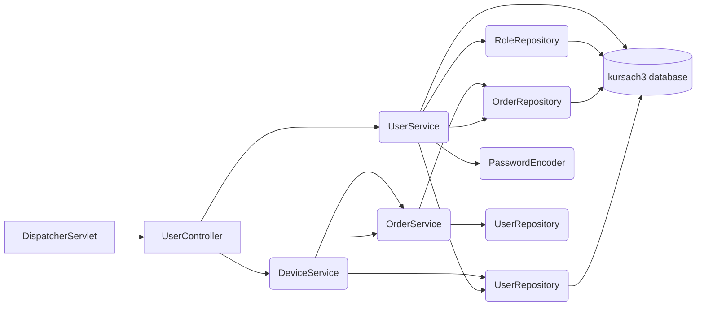
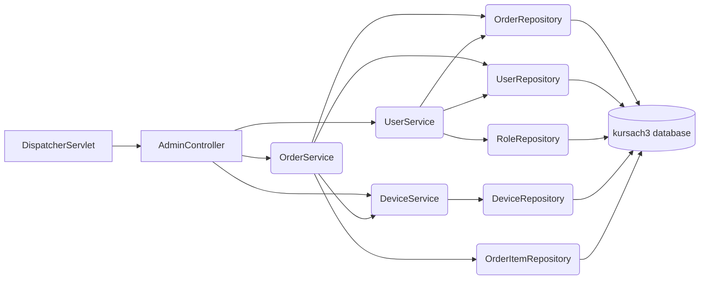
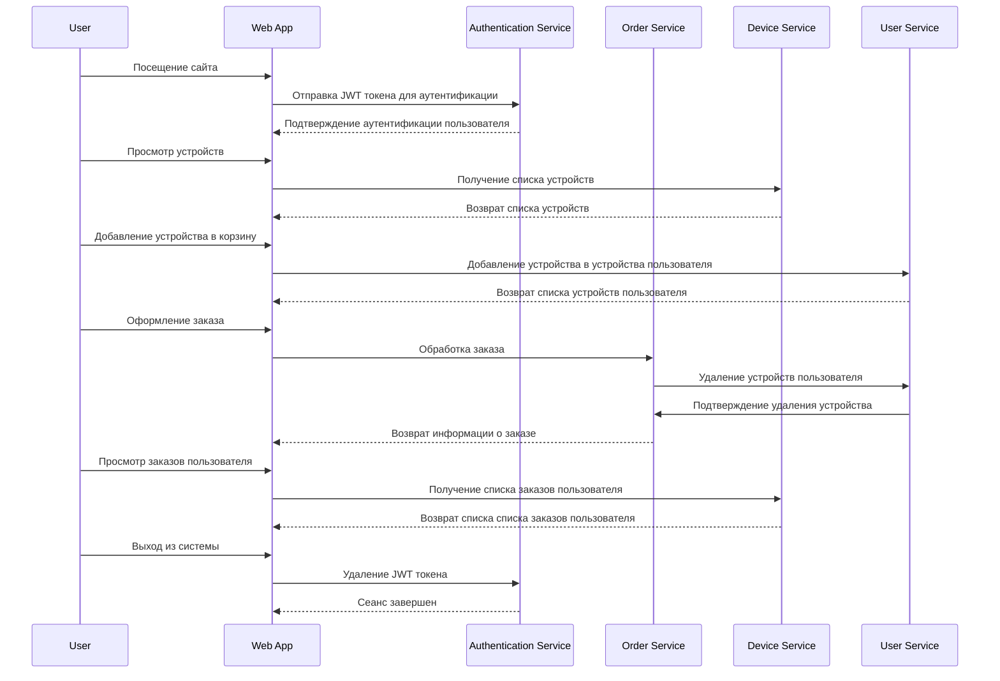
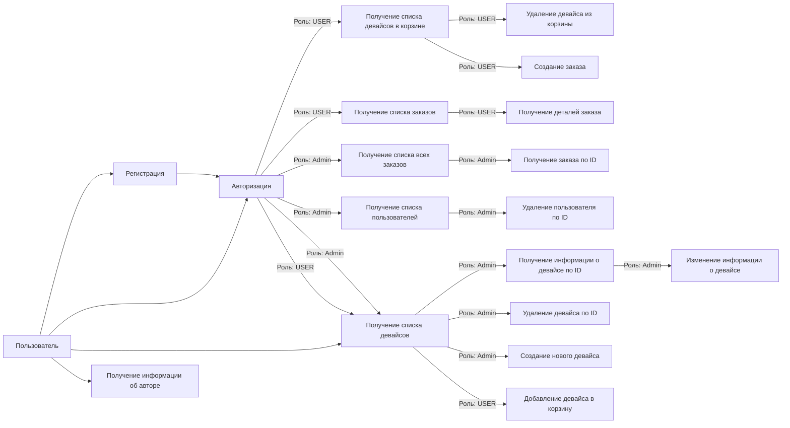

# TechTonic (Backend)
Backend часть магазина цифровой техники TechTonic разработана с использованием Spring Boot и Hibernate.
Актуальная версия frontend части находится по адресу: ... 
## Использованные технологии
+ Spring (Boot, Data, Security)
+ JPA / Hibernate
+ PostgreSQL
+ Maven
+ Lombok, slf4j
+ Postman
## Функционал
Пользователь без роли может:
+ смотреть главную страницу с товарами
+ зарегистрироваться (получить роль USER)
+ авторизоваться
+ смотреть страницу About (О авторе)

Пользователь с ролью USER может:
+ смотреть страницу About (О авторе)
+ выйти из аккаунта
+ смотреть главную страницу с товарами
+ искать товар по названию, типу, бренду, цене
+ добавить товар в корзину
+ смотреть список выбранных товаров в корзине
+ выбрать количество каждого товара в корзине
+ заказать выбранное количество товара в корзине
+ смотреть список своих заказов
+ смотреть детали каждого своего заказа
+ сортировать по возрастанию/убыванию таблицу своих заказов по ID (чем меньше ID, тем старее заказ) и суммарной цене заказа

Пользователь с ролью ADMIN может:
+ смотреть страницу About (О авторе)
+ выйти из аккаунта
+ смотреть главную страницу с товарами
+ искать товар по названию, типу, бренду, цене
+ удалить/обновить товар
+ смотреть таблицу, включающую в себя всех пользователей с ролью USER: ID пользователя, username пользователя, count orders (общее количество заказов) пользователя, user cost (общее количество потраченных денег) пользователя
+ сортировать по возрастанию/убыванию каждую колонку таблицы с пользователями с ролью USER
+ удалить любого пользователя с ролью USER
+ смотреть таблицу со всеми заказами пользователей с ролью USER
+ сортировать по возрастанию/убыванию  таблицу со всеми заказами пользователей с ролью USER
+ смотреть детали любого заказа из таблицы с заказами

[//]: # (![Solution Overview]&#40;https://github.com/IMS94/spring-boot-jwt-authorization/blob/master/authorization_process.png?raw=true "Solution Overview"&#41;)

## Диаграмма сущности базы данных

## Диаграмма работы controller-model 
### AuthController

### GuestController

### UserController

### AdminController

## Функционал

### Пример работы приложения

### Блок-схема возможностей пользователя

## Getting Started

- Используй команду `mvn clean install` в корневой директории проекта, чтобы собрать проект. 
- Запусти главный класс `com.kursach.TechTonicApplication`, чтобы запустить приложение.

## Endpoints

#### Общедоступные endpoints:
- `POST /signup` -> отправляет запрос на регистрацию нового пользователя
- `POST /login` -> отправляет запрос на подтверждение JWT токена для валидации пользователя (username/password)
- `GET /devices` -> возвращает список всех девайсов магазина
- `GET /about` -> возвращает информацию об авторе

#### Endpoints доступные пользователю с ролью USER:
- `GET /users/{username}/devices` -> возвращает список девайсов из корзины пользователя с ником `username`
- `POST /users/{username}/devices` -> отправляет запрос на добавление устройства в корзину пользователя с ником `username`
- `POST /users/{username}/devices/{deviceId}` -> отправляет запрос на удаление устройства с `deviceId` из корзины пользователя с ником `username`
- `GET /users/{username}/orders` -> возвращает список заказов пользователя с ником `username`
- `POST /users/{username}/orders` -> отправляет запрос на создание заказа пользователем с ником `username`
- `GET /users/{username}/orders/{orderId}` -> возваращает детали заказа с номером `orderId` пользователя с ником `username`

#### Endpoints доступные пользователю с ролью Admin:
- `GET /admins/orders` -> возвращает список заказов всех пользователей
- `GET /admins/orders/{orderId}` -> возвращает заказ под номером `orderId`
- `GET /admins/devices/{deviceId}` -> возвращает девай под номером `deviceId`
- `GET /admins/devices/delete/{id}` -> отправляет запрос на удаление девайса под номером `id`
- `POST /admins/devices` -> отправляет запрос на создание нового девайса
- `POST /admins/devices/update` -> отправляет запрос на изменение уже существующего девайса
- `GET /admins/users` -> возвращает список пользователей
- `POST /admins/users/{id}` -> отправляет запрос на удаление пользователя под номером `id`